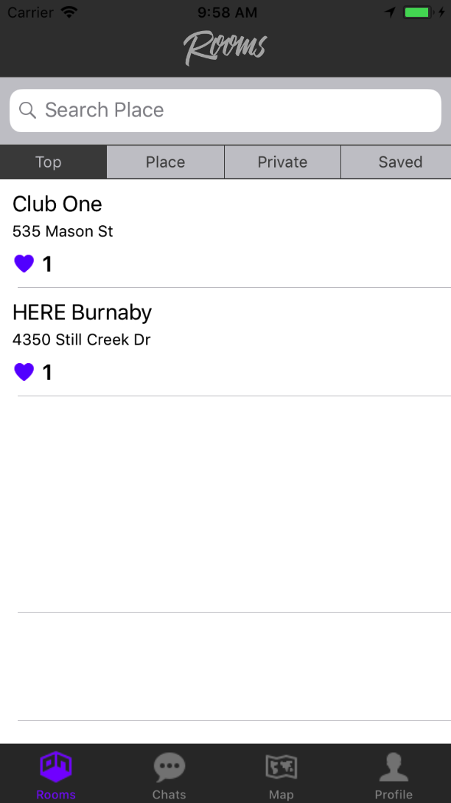
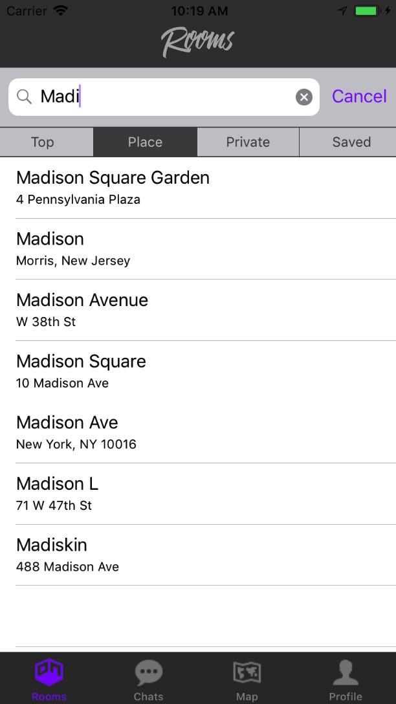
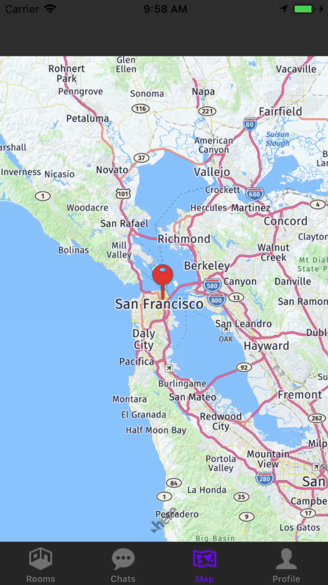
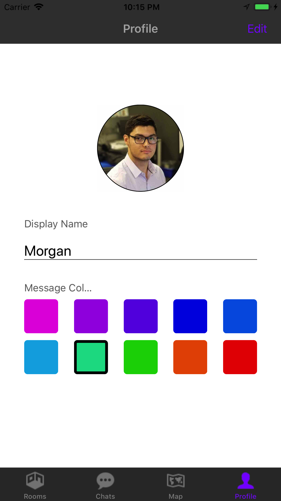

# Rooms : **Location Based Chatting**

## Project Summary

- Search for any location or venue and enter a chat room exclusive to that geolocation.
- Send image, video, or text messages in public or password protected chat rooms.
- Customize your profile picture, display name, and message bubble color.
- Authentication and storage handled by Google Firebase.
- Push Notifications managed by Google Cloud Messaging and server-side cloud functions.
- Supports offline capabilities thanks to the Cache framework.

### Login Screen

{:height="50%" width="50%"}

### Signup Screen

### Home Sceen

### Searching for Cool Places Screen

### Map Showing Active Rooms

### Chat Room

### Profile Screen

